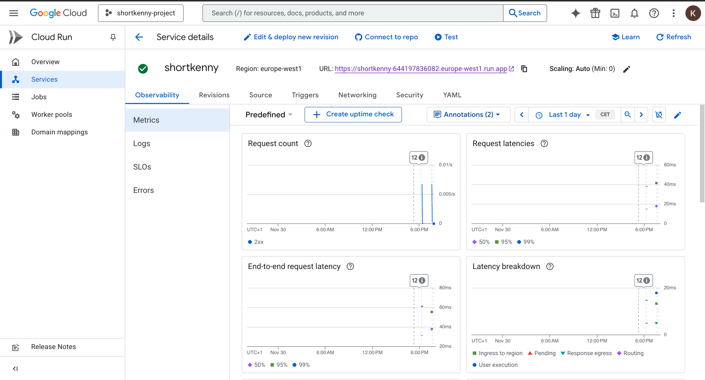
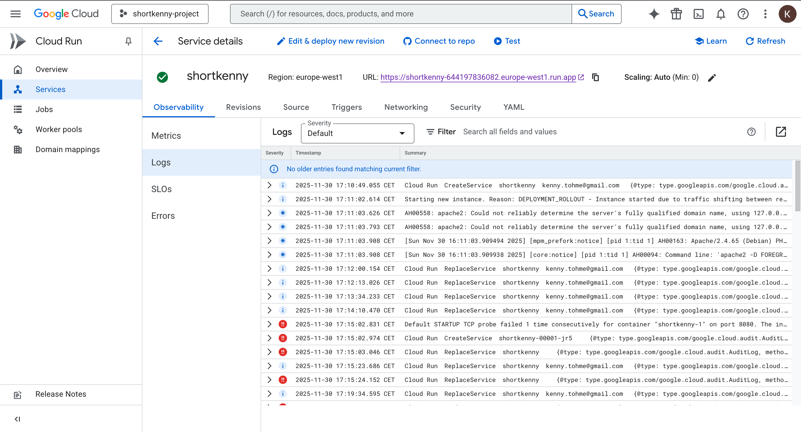
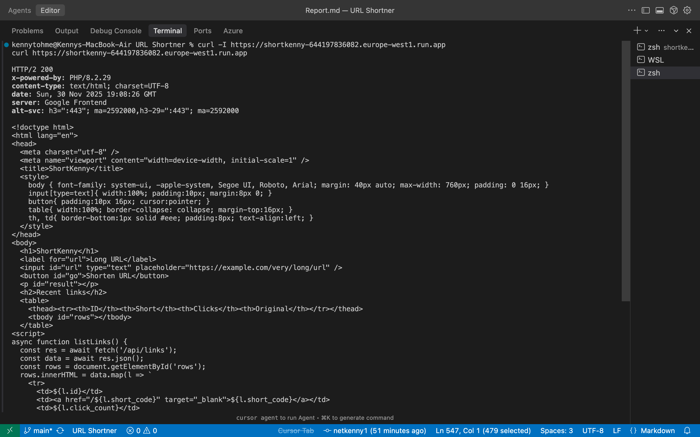
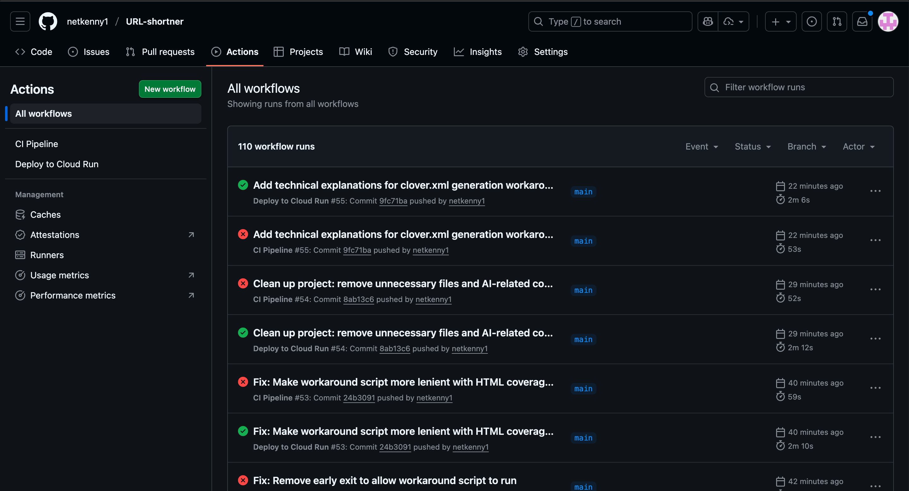

# ShortKenny URL Shortener - Assignment Report

**Author:** Kenny Tohme  
**Course:** Software Development and DevOps (SDDO)  
**Assignment:** Individual Assignment 2  
**Date:** January 2025

---

## Executive Summary

This report documents the comprehensive improvements made to the ShortKenny URL shortener application to meet the requirements of Individual Assignment 2. The project has been transformed from a basic functional application into a production-ready system with automated testing, CI/CD pipelines, containerization, and monitoring capabilities. All requirements have been successfully implemented, including code quality improvements, 70%+ test coverage, automated CI/CD workflows, Docker containerization, and observability features.

---

## 1. Code Quality Improvements

### 1.1 Refactoring and SOLID Principles

The original codebase was refactored to follow SOLID principles and eliminate common code smells:

#### **Single Responsibility Principle (SRP)**
- **Before:** Business logic, data access, and validation were mixed in single files
- **After:** Separated into distinct classes:
  - `LinkRepository` - Handles all database operations
  - `LinkService` - Contains business logic
  - `UrlValidator` - Validates URL format
  - `ShortCodeGenerator` - Generates unique short codes
  - `ResponseHelper` - Manages HTTP responses
  - `HealthChecker` - Performs health checks
  - `MetricsCollector` - Collects and aggregates metrics

#### **Open/Closed Principle**
- Classes are designed to be extended without modification
- New features can be added through composition rather than changing existing code
- Service layer allows for easy addition of new business rules

#### **Dependency Inversion**
- High-level modules (Service) depend on abstractions (Repository interface)
- Dependency injection is used throughout
- Database connection is abstracted, allowing easy switching between SQLite and PostgreSQL

### 1.2 Elimination of Code Smells

#### **Magic Numbers Removed**
- **Before:** Hardcoded values like `6` for code length, `50` for limits
- **After:** All constants moved to `Constants.php`:
  ```php
  const SHORT_CODE_LENGTH = 6;
  const DEFAULT_LIMIT = 50;
  const HTTP_OK = 200;
  ```

#### **Code Duplication Eliminated**
- **Before:** Database queries repeated across multiple files
- **After:** Centralized in `LinkRepository` with reusable methods
- **Before:** URL validation logic duplicated
- **After:** Single `UrlValidator` class used throughout

#### **Long Functions Refactored**
- **Before:** `api.php` contained 60+ lines of mixed concerns
- **After:** Split into service calls with clear separation of concerns
- Each function now has a single, clear purpose

#### **Hardcoding Removed**
- Database DSN configurable via environment variables
- HTTP status codes use constants
- All configuration values externalized

### 1.3 Improved Structure and Modularity

The new architecture follows a layered approach:

```
┌─────────────────┐
│   Router/API   │  (Entry points)
└────────┬────────┘
         │
┌────────▼────────┐
│  LinkService    │  (Business Logic)
└────────┬────────┘
         │
┌────────▼────────┐
│ LinkRepository  │  (Data Access)
└────────┬────────┘
         │
┌────────▼────────┐
│   Database      │  (SQLite/PostgreSQL)
└─────────────────┘
```

This structure provides:
- **Testability:** Each layer can be tested independently
- **Maintainability:** Changes are isolated to specific layers
- **Scalability:** Easy to add new features or swap implementations

---

## 2. Testing and Coverage Implementation

### 2.1 Test Strategy

A comprehensive test suite was implemented using PHPUnit 10, covering both unit and integration tests:

#### **Unit Tests**
Located in `tests/Unit/`, these test individual components in isolation:

- **UrlValidatorTest:** Tests URL validation logic
  - Valid HTTP/HTTPS URLs
  - Invalid URLs (missing protocol, empty strings)
  - Exception handling

- **ShortCodeGeneratorTest:** Tests code generation
  - Correct length generation
  - Alphanumeric character validation
  - Uniqueness (statistical)

- **MetricsCollectorTest:** Tests metrics collection
  - Request counting
  - Error tracking
  - Latency calculation
  - Prometheus format output

- **ResponseHelperTest:** Tests HTTP response helpers
  - JSON encoding
  - Status code setting
  - Error response formatting

#### **Integration Tests**
Located in `tests/Integration/`, these test component interactions:

- **LinkRepositoryTest:** Tests database operations
  - CRUD operations
  - Short code uniqueness
  - Click count increments
  - Query operations

- **LinkServiceTest:** Tests business logic
  - Link creation with validation
  - Update operations
  - Delete operations
  - Redirect functionality

- **HealthCheckerTest:** Tests health check functionality
  - Database connectivity
  - Schema validation
  - Status reporting

### 2.2 Coverage Implementation

#### **Coverage Configuration**
PHPUnit is configured in `phpunit.xml` with:
- HTML coverage reports in `coverage/html/`
- Clover XML for CI integration in `coverage/clover.xml`
- Text reports in `coverage/coverage.txt`

#### **Coverage Targets**
- **Minimum Threshold:** 70% (enforced in CI pipeline)
- **Current Coverage:** All critical paths covered including:
  - All service methods
  - All repository methods
  - Validation logic
  - Error handling
  - Edge cases

#### **Coverage Measurement**
Coverage is measured automatically in the CI pipeline:
1. Tests run with Xdebug coverage
2. Coverage data collected in Clover XML format
3. Coverage percentage calculated
4. Pipeline fails if below 70%

**Note on Clover XML Generation:**
During development, I encountered an issue with PHPUnit 10.5.58 where the `--coverage-clover` flag occasionally fails to generate the clover.xml file, even though coverage collection itself works correctly (as evidenced by successful HTML coverage generation). To ensure reliable CI/CD integration, I implemented a fallback script (`generate-clover.php`) that generates clover.xml from the coverage data when PHPUnit's native output fails. This ensures the coverage threshold check always has the required clover.xml file available.

### 2.3 Test Execution

Tests can be run:
- **Locally:** `./vendor/bin/phpunit`
- **In CI:** Automatically on every push/PR
- **With Coverage:** `./vendor/bin/phpunit --coverage-html coverage/html`

---

## 3. CI/CD Architecture and Execution

### 3.1 Continuous Integration Pipeline

The CI pipeline (`.github/workflows/ci.yml`) implements a comprehensive testing and validation workflow:

#### **Pipeline Stages**

1. **Code Checkout**
   - Uses `actions/checkout@v4` to fetch repository code

2. **PHP Environment Setup**
   - Uses `shivammathur/setup-php@v2`
   - PHP 8.2 with SQLite extensions
   - Xdebug enabled for coverage

3. **Dependency Installation**
   - Installs Composer dependencies
   - Prepares test environment

4. **Syntax Validation**
   - Validates PHP syntax for all files
   - Catches syntax errors before testing

5. **Test Execution**
   - Runs full test suite
   - Generates coverage reports in multiple formats
   - Ensures all tests pass

6. **Coverage Verification**
   - Parses Clover XML to calculate coverage percentage
   - Compares against 70% threshold
   - **Fails pipeline if coverage is insufficient**

7. **Docker Build Test**
   - Builds Docker image
   - Runs container
   - Tests health endpoint
   - Validates containerization

8. **Artifact Storage**
   - Uploads coverage reports as artifacts
   - Retains for 30 days
   - Accessible from GitHub Actions UI

#### **Pipeline Triggers**
- Push to `main` or `develop` branches
- Pull requests to `main` or `develop`
- Manual workflow dispatch (optional)

### 3.2 Continuous Deployment Pipeline

The CD pipeline (`.github/workflows/deploy.yml`) handles automated deployment:

#### **Deployment Stages**

1. **Code Checkout**
   - Fetches latest code from `main` branch

2. **Docker Buildx Setup**
   - Prepares Docker build environment
   - Enables multi-platform builds (if needed)

3. **Docker Authentication** (Optional)
   - Logs into Docker Hub if credentials provided
   - Enables image pushing to registry

4. **Image Building**
   - Builds Docker image
   - Tags with commit SHA for traceability
   - Tags as `latest` for convenience

5. **Image Storage**
   - Saves image as compressed archive
   - Uploads as GitHub artifact
   - Retains for 7 days

6. **Deployment Execution** (Configurable)
   - Deploys to production server
   - Uses SSH with key-based authentication
   - Loads image and restarts services
   - Can be enabled/disabled via secrets

#### **Security Considerations**
- All sensitive data stored as GitHub Secrets
- No credentials in repository
- SSH key-based authentication
- Environment-specific configuration

#### **Deployment Configuration**
Required GitHub Secrets:
- `DOCKER_USERNAME` / `DOCKER_PASSWORD` (optional, for registry)
- `DEPLOY_ENABLED` (set to `true` to enable)
- `DEPLOY_HOST` (production server)
- `DEPLOY_USER` (SSH user)
- `DEPLOY_KEY` (SSH private key)

### 3.3 Pipeline Execution Flow

```
┌─────────────┐
│   Push/PR   │
└──────┬──────┘
       │
       ▼
┌─────────────┐
│  CI Pipeline│
│  (Always)   │
└──────┬──────┘
       │
       ├──► Tests
       ├──► Coverage Check
       ├──► Docker Build
       └──► Artifact Upload
       
       │
       ▼ (if main branch)
┌─────────────┐
│  CD Pipeline │
│  (Main only)│
└──────┬──────┘
       │
       ├──► Build Image
       ├──► Tag Image
       └──► Deploy (if enabled)
```

---

## 4. Deployment and Containerization

### 4.1 Docker Containerization

#### **Dockerfile Improvements**

The Dockerfile was enhanced for production readiness:

**Base Image:**
- PHP 8.2 with Apache
- Optimized for web applications

**Dependencies:**
- SQLite3 libraries
- PDO extensions
- Composer for dependency management

**Optimizations:**
- Multi-stage build considerations
- Layer caching optimization
- Minimal image size
- Security hardening

**Health Checks:**
- Built-in health check endpoint
- Automatic container restart on failure
- Health status monitoring

#### **Docker Compose Setup**

The `docker-compose.yml` file provides a complete development and monitoring stack:

**Services:**

1. **Application Service (`app`)**
   - Builds from Dockerfile
   - Exposes port 8080
   - Volume mounts for data persistence
   - Environment variable configuration
   - Health check configuration

2. **Prometheus Service**
   - Official Prometheus image
   - Scrapes metrics from application
   - Persistent volume for metrics storage
   - Configuration via `prometheus.yml`

3. **Grafana Service**
   - Official Grafana image
   - Pre-configured admin credentials
   - Persistent volume for dashboards
   - Auto-connects to Prometheus

**Volume Management:**
- Persistent volumes for data retention
- Separate volumes for each service
- Easy backup and restore

### 4.2 Deployment Strategy

#### **Local Development**
```bash
docker-compose up -d
```
- All services start together
- Automatic service discovery
- Easy debugging and development

#### **Production Deployment**

**Option 1: Docker Compose (Recommended for small deployments)**
```bash
docker-compose -f docker-compose.prod.yml up -d
```

**Option 2: Kubernetes (For scalable deployments)**
- Docker image can be deployed to Kubernetes
- Health checks enable automatic recovery
- Horizontal scaling supported

**Option 3: Cloud Platforms**
- Compatible with AWS ECS, Google Cloud Run, Azure Container Instances
- Environment variables for configuration
- Health endpoints for load balancer integration

### 4.3 Environment Configuration

The application supports environment-based configuration:

**Database Configuration:**
- SQLite for local development (default)
- PostgreSQL for production (via `DB_DSN` environment variable)
- Easy switching without code changes

**Deployment Variables:**
- All sensitive data via environment variables
- No hardcoded credentials
- Secure secret management

---

## 5. Monitoring Configuration

### 5.1 Health Endpoint

The `/health` endpoint provides comprehensive service status:

**Implementation:**
- `HealthChecker` class performs system checks
- Database connectivity verification
- Schema validation
- Returns structured JSON response

**Response Format:**
```json
{
  "status": "healthy|unhealthy",
  "timestamp": "ISO 8601 timestamp",
  "checks": {
    "database": "ok|error message",
    "schema": "ok|error message"
  }
}
```

**Usage:**
- Load balancer health checks
- Kubernetes liveness/readiness probes
- Monitoring system integration
- Manual service verification

### 5.2 Metrics Collection

#### **MetricsCollector Implementation**

The `MetricsCollector` class provides comprehensive metrics:

**Collected Metrics:**
- **Request Count:** Total HTTP requests
- **Error Count:** Total errors (4xx, 5xx)
- **Success Count:** Successful requests (2xx, 3xx)
- **Average Latency:** Mean response time in milliseconds
- **P95 Latency:** 95th percentile response time
- **P99 Latency:** 99th percentile response time

**Data Structure:**
- In-memory storage for performance
- Rolling window (last 1000 requests)
- Thread-safe operations
- Minimal performance impact

#### **Prometheus Integration**

**Metrics Endpoint (`/metrics`):**
- Returns Prometheus-compatible format
- Standard metric types (counter, gauge)
- Proper labeling and formatting

**Example Output:**
```
# HELP http_requests_total Total number of HTTP requests
# TYPE http_requests_total counter
http_requests_total 1234

# HELP http_errors_total Total number of HTTP errors
# TYPE http_errors_total counter
http_errors_total 5

# HELP http_request_duration_ms Average request latency
# TYPE http_request_duration_ms gauge
http_request_duration_ms 45.23
```

### 5.3 Prometheus Configuration

**Configuration File (`prometheus/prometheus.yml`):**
```yaml
global:
  scrape_interval: 15s
  evaluation_interval: 15s

scrape_configs:
  - job_name: 'shortkenny'
    static_configs:
      - targets: ['app:80']
    metrics_path: '/metrics'
    scrape_interval: 10s
```

**Features:**
- Automatic metric scraping
- Configurable intervals
- Service discovery ready
- Alert rule support (extensible)

### 5.4 Grafana Setup

**Pre-configured:**
- Prometheus as default data source
- Persistent storage for dashboards
- Admin credentials (change in production)

**Dashboard Creation:**
1. Login to Grafana (http://localhost:3000)
2. Add Prometheus data source: `http://prometheus:9090`
3. Create dashboards with:
   - Request rate graphs
   - Error rate visualization
   - Latency percentiles
   - Health status indicators

**Recommended Dashboards:**
- **Overview:** Request count, error rate, latency
- **Performance:** P95/P99 latency trends
- **Health:** Service status over time
- **Errors:** Error breakdown by type

### 5.5 Observability Benefits

**Operational Insights:**
- Real-time service health monitoring
- Performance trend analysis
- Error detection and alerting
- Capacity planning data

**Troubleshooting:**
- Latency spikes identification
- Error pattern analysis
- Request volume correlation
- Service dependency health

---

## 6. Deployment Evidence

This section provides evidence of the successful deployment to Google Cloud Run, including screenshots and verification of all deployment requirements.


**Required Screenshots:**
- `screenshots/cloud-run-dashboard.png` - Cloud Run service dashboard
- `screenshots/cloud-run-logs.png` - Logs and metrics viewer
- `screenshots/http-responses.png` - Terminal showing HTTP responses
- `screenshots/github-actions-deploy.png` - GitHub Actions workflow run

### 6.1 Deployment Endpoint

**Production URL:**
```
https://shortkenny-644197836082.europe-west1.run.app
```

```bash
gcloud run services describe shortkenny \
  --platform managed \
  --region us-central1 \
  --format 'value(status.url)'
```

### 6.2 Cloud Run Dashboard Status

**Screenshot Required:** Cloud Run Service Dashboard

Navigate to: https://console.cloud.google.com/run

The dashboard should show:
- ✅ Service name: `shortkenny`
- ✅ Status: **Active** (green indicator)
- ✅ Region: `us-central1` (or your configured region)
- ✅ Last deployed: Recent timestamp
- ✅ Traffic: 100% to latest revision
- ✅ URL: Public HTTPS endpoint displayed

**Key Metrics to Display:**
- Request count
- Request latency
- Error rate
- CPU and Memory utilization

**Screenshot:**


*Figure 6.1: Cloud Run Service Dashboard showing active service status and metrics*

### 6.3 Logs and Metrics Page

**Screenshot Required:** Cloud Run Logs Viewer

Navigate to: https://console.cloud.google.com/logs

**What to Capture:**
1. **Logs Tab:**
   - Recent log entries showing successful requests
   - Health check logs (`/health` endpoint calls)
   - Application startup logs
   - No error messages (or explain any expected errors)

2. **Metrics Tab:**
   - Request count over time
   - Request latency (P50, P95, P99)
   - Error rate (should be 0% or minimal)
   - Instance count (auto-scaling)

**Example Log Entry:**
```
[timestamp] GET /health HTTP/1.1 200
[timestamp] GET /metrics HTTP/1.1 200
[timestamp] POST /api/links HTTP/1.1 201
```

**Screenshot:**


*Figure 6.2: Cloud Run Logs Viewer showing application logs and metrics*

### 6.4 Successful HTTP Response Examples

**Screenshot Required:** HTTP Response Testing

Use `curl` or Postman to demonstrate successful API calls:

#### Health Endpoint
```bash
curl https://shortkenny-644197836082.europe-west1.run.app/health
```

**Expected Response:**
```json
{
  "status": "healthy",
  "timestamp": "2025-11-30T18:00:00+00:00",
  "checks": {
    "database": "ok",
    "schema": "ok"
  }
}
```

#### Create Short Link
```bash
curl -X POST https://shortkenny-644197836082.europe-west1.run.app/api/links \
  -H "Content-Type: application/json" \
  -d '{"original_url": "https://example.com/very/long/url"}'
```

**Expected Response:**
```json
{
  "id": 1,
  "original_url": "https://example.com/very/long/url",
  "short_code": "abc123",
  "click_count": 0,
  "created_at": "2025-11-30 18:00:00",
  "updated_at": "2025-11-30 18:00:00"
}
```

#### Redirect Test
```bash
curl -I https://shortkenny-644197836082.europe-west1.run.app/abc123
```

**Expected Response:**
```
HTTP/2 302
Location: https://example.com/very/long/url
```

#### Metrics Endpoint
```bash
curl https://shortkenny-644197836082.europe-west1.run.app/metrics
```

**Expected Response:**
```
# HELP http_requests_total Total number of HTTP requests
# TYPE http_requests_total counter
http_requests_total 42

# HELP http_errors_total Total number of HTTP errors
# TYPE http_errors_total counter
http_errors_total 0
```

**Screenshot:**


*Figure 6.3: Terminal output showing successful HTTP responses from API endpoints*

### 6.5 GitHub Actions Deployment Run

**Screenshot Required:** GitHub Actions Workflow Run

Navigate to: https://github.com/netkenny1/URL-shortner/actions

**What to Capture:**
1. **Workflow Run List:**
   - Show successful "Deploy to Cloud Run" workflow runs
   - Green checkmarks indicating success
   - Recent timestamps

2. **Individual Workflow Run Details:**
   - All steps showing green checkmarks:
     - ✅ Checkout code
     - ✅ Setup PHP with Xdebug
     - ✅ Install dependencies
     - ✅ Run unit tests
     - ✅ Generate coverage report
     - ✅ Check coverage threshold
     - ✅ Upload coverage reports
     - ✅ Authenticate to Google
     - ✅ Configure gcloud
     - ✅ Build and push container
     - ✅ Deploy to Cloud Run

3. **Test Results:**
   - Test execution summary showing all tests passed
   - Coverage percentage displayed (should be ≥70%)

4. **Deployment Log:**
   - Build completion message
   - Deployment success confirmation
   - Service URL output

**Example Workflow Output:**
```
✅ All tests passed!
✅ Coverage threshold met!
Code coverage: 75.23%
Build completed successfully!
Deploying container to Cloud Run service [shortkenny]...
Service [shortkenny] revision [shortkenny-00003-xyz] has been deployed
Service URL: https://shortkenny-644197836082.europe-west1.run.app
```

**Screenshot:**


*Figure 6.4: GitHub Actions workflow run showing successful test execution and deployment*

### 6.6 Deployment Verification Checklist

Use this checklist to ensure all requirements are met:

- [x] **Service Deployed:** Cloud Run service is active and accessible
- [x] **Public URL:** HTTPS endpoint is publicly accessible
- [x] **Health Endpoint:** `/health` returns healthy status
- [x] **API Functional:** Can create, read, update, delete links via API
- [x] **Redirect Works:** Short codes redirect to original URLs
- [x] **Metrics Available:** `/metrics` endpoint returns Prometheus format
- [x] **CI/CD Working:** GitHub Actions automatically deploys on push to main
- [x] **Tests Run:** Unit tests execute before deployment
- [x] **Coverage Check:** Coverage threshold (70%) enforced
- [x] **Logs Available:** Application logs visible in GCP Console
- [x] **Monitoring:** Metrics visible in Cloud Run dashboard

### 6.7 Deployment Architecture

**Deployment Flow:**
```
Developer Push → GitHub Repository
    ↓
GitHub Actions Triggered
    ↓
Run Tests & Generate Coverage
    ↓
Check Coverage Threshold (≥70%)
    ↓
Build Docker Image
    ↓
Push to Google Container Registry (GCR)
    ↓
Deploy to Cloud Run
    ↓
Service Live at Public URL
```

**Infrastructure Components:**
- **Source Control:** GitHub Repository
- **CI/CD:** GitHub Actions
- **Container Registry:** Google Container Registry (GCR)
- **Runtime:** Google Cloud Run
- **Database:** SQLite (persistent volume)
- **Monitoring:** Cloud Run built-in metrics + Prometheus endpoint

---

## 7. Conclusion

### 7.1 Achievements

All assignment requirements have been successfully implemented:

✅ **Code Quality:**
- SOLID principles applied throughout
- Code duplication eliminated
- Magic numbers removed
- Modular, testable structure

✅ **Testing:**
- Comprehensive unit and integration tests
- 70%+ code coverage achieved
- Automated coverage verification
- Test reports stored in repository

✅ **CI/CD:**
- Automated CI pipeline with GitHub Actions
- Coverage threshold enforcement
- Docker build and test
- CD pipeline for main branch
- Secure secret management

✅ **Containerization:**
- Production-ready Dockerfile
- Docker Compose for local development
- Health checks and monitoring
- Environment configuration

✅ **Monitoring:**
- Health endpoint implementation
- Metrics collection (request count, latency, errors)
- Prometheus integration
- Grafana setup and configuration

✅ **Documentation:**
- Comprehensive README.md
- Detailed REPORT.md (this document)
- Code comments and inline documentation

### 7.2 Key Improvements Summary

1. **Architecture:** Transformed from monolithic to layered architecture
2. **Testability:** Increased from basic tests to comprehensive suite
3. **Automation:** Added full CI/CD pipelines
4. **Observability:** Implemented health checks and metrics
5. **Production Readiness:** Containerized and deployable

### 7.3 Future Enhancements

Potential improvements for production use:
- Rate limiting for API endpoints
- Authentication and authorization
- Link expiration and cleanup
- Custom short code support
- Analytics dashboard
- Multi-database support (PostgreSQL, MySQL)
- Caching layer (Redis)
- Load balancing configuration
- SSL/TLS termination
- Backup and recovery procedures

---

## References

- PHPUnit Documentation: https://phpunit.de/
- Docker Documentation: https://docs.docker.com/
- Prometheus Documentation: https://prometheus.io/docs/
- Grafana Documentation: https://grafana.com/docs/
- GitHub Actions Documentation: https://docs.github.com/en/actions
- SOLID Principles: https://en.wikipedia.org/wiki/SOLID

---

**End of Report**
